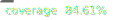

# TallyCheck Corporate & School Suite — Monorepo Architecture



> **TallyCheck** is an enterprise-grade, multi-tenant SaaS platform for employee workforce management, BLE beacon presence verification, and **SafeChild** daycare/Sunday school safe pickup tracking.
> 
> Built on a robust **Angular frontend** and a multi-tenant **Python Flask + PostgreSQL backend**, co-located and orchestrated locally using **Docker Compose** and **Nx**.

---

## 🚀 Quick Start — Running the Stack

### 1. Frontend Development Server (Angular)
```bash
# Install dependencies
npm install

# Start the Intranet portal
npx nx serve intranet            # → http://localhost:4200
```

### 2. Backend Development Server (Flask)
```bash
# Navigate to backend folder
cd apps/intranet/backend

# Create virtual environment and install requirements
python -m venv .venv
.venv\Scripts\activate
pip install -r requirements.txt

# Create .env config from example
cp .env.example .env

# Apply database migrations
.venv\Scripts\flask db upgrade

# Run backend development server
.venv\Scripts\flask run --port=5000  # → http://localhost:5000
```

---

## 🔐 Role System & Permission Matrix

TallyCheck uses a **permission matrix** for fine-grained access control across Corporate, Education, and Community (Church/Sunday School) tenants.

### Roles

| Role | Category | Description |
|------|----------|-------------|
| `staff` | Corporate | General employee / student |
| `company_admin` | Corporate | Company-level administrator |
| `hr_admin` | Corporate | HR / People Operations |
| `department_manager` | Corporate | Line manager / supervisor |
| `school_admin` | Education | University / school administrator |
| `lecturer` | Education | University lecturer / instructor |
| `teacher` | Community | Sunday school / daycare teacher |
| `guardian` | Community | Parent / authorized pickup person |
| `super_admin` | Platform | TallyCheck platform super admin |
| `it_admin` | Platform | IT / technical administrator |

### Permission Matrix (excerpt)

| Permission | Staff | Company Admin | HR Admin | Dept Manager | Teacher | Guardian | Super Admin |
|------------|:-----:|:------------:|:--------:|:------------:|:-------:|:--------:|:-----------:|
| `view:own_attendance` | ✅ | ✅ | ✅ | ✅ | ✅ | | ✅ |
| `clock:in_out` | ✅ | ✅ | ✅ | ✅ | ✅ | | ✅ |
| `view:departments` | ✅ | ✅ | ✅ | ✅ | | | ✅ |
| `edit:departments` | | ✅ | ✅ | | | | ✅ |
| `view:employees` | | ✅ | ✅ | ✅ | | | ✅ |
| `edit:employees` | | ✅ | ✅ | | | | ✅ |
| `approve:employees` | | ✅ | ✅ | | | | ✅ |
| `view:beacons` | | ✅ | ✅ | | | | ✅ |
| `manage:beacons` | | ✅ | ✅ | | | | ✅ |
| `view:reports` | | ✅ | ✅ | ✅ | | | ✅ |
| `safechild:drop_off` | | | ✅ | ✅ | ✅ | ✅ | ✅ |
| `safechild:pickup` | | | ✅ | ✅ | ✅ | ✅ | ✅ |
| `manage:settings` | | ✅ | | | | | ✅ |
| `manage:organizations` | | | | | | | ✅ |

### Usage in Code

```typescript
// In Angular templates — permission-based UI gating
@if (auth.can('manage:beacons')) {
  <button>Manage Beacons</button>
}

// In TypeScript — direct helper
import { hasPermission } from '@omni/auth';
if (hasPermission(role, 'safechild:drop_off')) { ... }
```

---

## 🏛️ Architecture Details

### 1. Secure Multi-Tenant Schema Isolation
TallyCheck uses **PostgreSQL Schema-based Isolation** (One Schema Per Tenant).
*   **Public Schema**: Houses `public.organizations` (the tenant directory).
*   **Tenant Schema**: When a tenant is resolved (e.g. Daystar University), the backend dynamically scopes all subsequent tables (`employees`, `attendance_records`, `ble_beacons`, `children`, `pickup_tokens`) to `tenant_<org_id>` using a connection-level `search_path` interceptor middleware.
*   **Auth0 Organizations**: Connects corporate and academic Identity Providers (SSO) directly to individual tenant schemas using Auth0 B2B token claims.

### 2. BLE Beacon Proximity Tracking
*   **Hardware Registry**: Register MAC addresses, Major, Minor, and proximity boundaries for BLE beacons.
*   **Department Assignment**: Assign registered beacons to physical offices or rooms to enforce geo-presence verification rules.

### 3. SafeChild Drop-off & Pickup Verification
*   **Single-Use Tokens**: Child drop-off generates a secure, random 4-digit PIN and a signed QR payload.
*   **HMAC-SHA256 Signatures**: QR code payloads are signed with a server-side `SAFECHILD_HMAC_SECRET` to prevent tampering.
*   **IP-Based Rate Limiting**: Verification requests to `/safechild/pickup/verify` are protected by a sliding-window rate limiter to block PIN brute-forcing.

---

## 🖥️ Production Server Configuration & Route Matrix

### 1. Server Configuration (`Contabo VPS — 185.202.239.223`)
- **OS**: Ubuntu 24.04.4 LTS (GNU/Linux 6.8.0-106-generic x86_64)
- **Deployment Directory**: `/root/tallycheck` (Docker Compose production stack)
- **Active Container Network Ports**:
  - `0.0.0.0:8085 -> 80`: Caddy HTTP Gateway (Reverse Proxy -> Angular Intranet)
  - `0.0.0.0:8443 -> 443`: Caddy HTTPS Gateway (Automatic Let's Encrypt TLS)
  - `0.0.0.0:8005 -> 5000`: Python Flask API Gateway Direct Host Binding
  - `5432`: PostgreSQL 15 Database (Internal container network `omni_intranet_db`)

---

### 2. Live Application Route Matrix (`http://185.202.239.223:8085`)

| Route Path | Category | Allowed Roles | Description |
| :--- | :--- | :--- | :--- |
| `/home` | Workspace | All Roles | Dashboard greeting, personal shift clock-in/out widget, active SafeChild pickup passes, and live news feed. |
| `/organizations` | Workspace | `super_admin`, `it_admin` | Multi-tenant tenant schema manager & organization provisioning portal. |
| `/departments` | Workspace | `company_admin`, `hr_admin`, `department_manager`, `school_admin` | Department tree structure & manager assignments. |
| `/attendance-records` | Workspace | All Roles | Personal attendance timesheet & logged shift history. |
| `/team` | HR & People | `hr_admin`, `department_manager`, `company_admin` | Live team presence, real-time clock-in logs, and department member status. |
| `/employees` | HR & People | `company_admin`, `hr_admin` | Employee directory, staff onboarding approvals, and profile management. |
| `/beacons` | HR & People | `hr_admin`, `it_admin`, `company_admin` | BLE Beacon hardware registry, RSSI signal strength monitoring, and office zone mapping. |
| `/reports` | HR & People | `company_admin`, `hr_admin`, `department_manager` | HR Attendance reports, real-time KPI headcount metrics, department breakdown, and ApexCharts trend analytics. |
| `/safechild` | Sunday School | `teacher`, `guardian`, `school_admin` | SafeChild Sunday school class roster, child drop-off, single-use PIN generator, and digital pass checkout verification. |
| `/safechild-reports` | Sunday School | `teacher`, `school_admin`, `hr_admin` | Sunday School ministry child attendance & checkout analytics dashboard. |
| `/users-roles` | Administration | `super_admin`, `it_admin`, `company_admin` | Platform user role assignment & RBAC permissions management. |
| `/settings` | Administration | `super_admin`, `it_admin`, `company_admin` | Global platform settings, shift cutoff windows, and notifications. |
| `/audit` | Administration | `super_admin`, `it_admin` | Audit log trail for manual overrides, clock-in edits, and security events. |

---

### 3. Backend API Gateway Endpoints (`http://185.202.239.223:8005/api`)

| API Route | HTTP Method | Description |
| :--- | :--- | :--- |
| `/api/auth/sync` | `POST` | Auth0 token sync, tenant schema resolution, and user role creation. |
| `/api/attendance/clock-in` | `POST` | Verified clock-in via BLE beacon RSSI validation or location QR token. |
| `/api/attendance/clock-out` | `POST` | Clock-out logging with shift hours calculation. |
| `/api/organizations` | `GET`, `POST` | Multi-tenant organization list & tenant schema creation. |
| `/api/departments` | `GET`, `POST` | Department list and tree structure. |
| `/api/employees` | `GET`, `POST`, `PUT` | Staff directory list, approval, and updates. |
| `/api/beacons` | `GET`, `POST`, `PUT` | BLE beacon registry, location assignment, and signal bounds. |
| `/api/safechild/children` | `GET` | Sunday school class roster filtering. |
| `/api/safechild/drop-off` | `POST` | Child drop-off registration, 4-digit PIN generation, and signed QR payload creation. |
| `/api/safechild/pickup/verify` | `POST` | Single-use PIN pickup authorization & guardian verification. |
| `/api/reports/dashboard` | `GET` | Real-time KPI metrics (headcount, present/absent, late arrivals). |
| `/api/reports/employee-attendance` | `GET` | Paginated employee attendance summary reports. |
| `/api/reports/trends` | `GET` | Daily/weekly/monthly attendance trend data for ApexCharts. |

---

## 🖥️ Production Server Configuration & Route Matrix

### 1. Server Configuration (`Contabo VPS — 185.202.239.223`)
- **OS**: Ubuntu 24.04.4 LTS (GNU/Linux 6.8.0-106-generic x86_64)
- **Deployment Directory**: `/root/tallycheck` (Docker Compose production stack)
- **Active Container Network Ports**:
  - `0.0.0.0:8085 -> 80`: Caddy HTTP Gateway (Reverse Proxy -> Angular Intranet)
  - `0.0.0.0:8443 -> 443`: Caddy HTTPS Gateway (Automatic Let's Encrypt TLS)
  - `0.0.0.0:8005 -> 5000`: Python Flask API Gateway Direct Host Binding
  - `5432`: PostgreSQL 15 Database (Internal container network `omni_intranet_db`)

---

### 2. Live Application Route Matrix (`http://185.202.239.223:8085`)

| Route Path | Category | Allowed Roles | Description |
| :--- | :--- | :--- | :--- |
| `/home` | Workspace | All Roles | Dashboard greeting, personal shift clock-in/out widget, active SafeChild pickup passes, and live news feed. |
| `/organizations` | Workspace | `super_admin`, `it_admin` | Multi-tenant tenant schema manager & organization provisioning portal. |
| `/departments` | Workspace | `company_admin`, `hr_admin`, `department_manager`, `school_admin` | Department tree structure & manager assignments. |
| `/attendance-records` | Workspace | All Roles | Personal attendance timesheet & logged shift history. |
| `/team` | HR & People | `hr_admin`, `department_manager`, `company_admin` | Live team presence, real-time clock-in logs, and department member status. |
| `/employees` | HR & People | `company_admin`, `hr_admin` | Employee directory, staff onboarding approvals, and profile management. |
| `/beacons` | HR & People | `hr_admin`, `it_admin`, `company_admin` | BLE Beacon hardware registry, RSSI signal strength monitoring, and office zone mapping. |
| `/reports` | HR & People | `company_admin`, `hr_admin`, `department_manager` | HR Attendance reports, real-time KPI headcount metrics, department breakdown, and ApexCharts trend analytics. |
| `/safechild` | Sunday School | `teacher`, `guardian`, `school_admin` | SafeChild Sunday school class roster, child drop-off, single-use PIN generator, and digital pass checkout verification. |
| `/safechild-reports` | Sunday School | `teacher`, `school_admin`, `hr_admin` | Sunday School ministry child attendance & checkout analytics dashboard. |
| `/users-roles` | Administration | `super_admin`, `it_admin`, `company_admin` | Platform user role assignment & RBAC permissions management. |
| `/settings` | Administration | `super_admin`, `it_admin`, `company_admin` | Global platform settings, shift cutoff windows, and notifications. |
| `/audit` | Administration | `super_admin`, `it_admin` | Audit log trail for manual overrides, clock-in edits, and security events. |

---

### 3. Backend API Gateway Endpoints (`http://185.202.239.223:8005/api`)

| API Route | HTTP Method | Description |
| :--- | :--- | :--- |
| `/api/auth/sync` | `POST` | Auth0 token sync, tenant schema resolution, and user role creation. |
| `/api/attendance/clock-in` | `POST` | Verified clock-in via BLE beacon RSSI validation or location QR token. |
| `/api/attendance/clock-out` | `POST` | Clock-out logging with shift hours calculation. |
| `/api/organizations` | `GET`, `POST` | Multi-tenant organization list & tenant schema creation. |
| `/api/departments` | `GET`, `POST` | Department list and tree structure. |
| `/api/employees` | `GET`, `POST`, `PUT` | Staff directory list, approval, and updates. |
| `/api/beacons` | `GET`, `POST`, `PUT` | BLE beacon registry, location assignment, and signal bounds. |
| `/api/safechild/children` | `GET` | Sunday school class roster filtering. |
| `/api/safechild/drop-off` | `POST` | Child drop-off registration, 4-digit PIN generation, and signed QR payload creation. |
| `/api/safechild/pickup/verify` | `POST` | Single-use PIN pickup authorization & guardian verification. |
| `/api/reports/dashboard` | `GET` | Real-time KPI metrics (headcount, present/absent, late arrivals). |
| `/api/reports/employee-attendance` | `GET` | Paginated employee attendance summary reports. |
| `/api/reports/trends` | `GET` | Daily/weekly/monthly attendance trend data for ApexCharts. |

---

## 📂 Folder Structure

```
tallycheck-corporate/
├── apps/
│   └── intranet/                     ← Main portal application
│       ├── src/app/features/
│       │   ├── login/                ← Subdomain name resolution & Auth0 redirect
│       │   ├── beacons/              ← BLE beacon listing & department assignment view
│       │   ├── home/                 ← Dashboard with check-in widgets & active shifts
│       │   ├── safechild/            ← Class check-in roster, drop-off & pickup flows
│       │   ├── employees/            ← Employee management & approval
│       │   ├── team/                 ← Team attendance overview
│       │   └── departments/          ← Organizational structure definition
│       └── backend/                  ← Flask API Gateway
│           ├── migrations/           ← Database migration versions (Alembic)
│           ├── schemas/              ← Serialization schemas (beacons, employees, etc.)
│           ├── utils/
│           │   └── tenant_middleware.py ← Dynamic search_path schema selection middleware
│           ├── auth_routes.py        ← Organization subdomain lookup endpoint
│           ├── beacon_routes.py      ← BLE beacon registry and assignment endpoints
│           └── safechild_routes.py   ← Children list, drop-off logging, and verify APIs
├── libs/
│   ├── auth/                         ← Auth0 org-aware auth, roles, permission matrix
│   │   ├── roles.ts                  ← RoleKey, PERMISSION_MATRIX, hasPermission()
│   │   ├── services/auth.service.ts  ← AuthService with can() method
│   │   └── guards/auth.guard.ts      ← authGuard + roleGuard
│   ├── shell/                        ← Permission-driven sidebar navigation
│   │   ├── nav.ts                    ← navForRole() — builds nav groups from permissions
│   │   └── sidebar.component.ts      ← Role switcher + dynamic nav rendering
│   ├── theme/                        ← Shared SCSS tokens, fonts, and resets
│   └── ui/                           ← Shared premium cards, pills, buttons, and icons
```

---

## 🛠️ Common Platform Commands

```bash
# Run tests
npx nx test intranet

# Generate production build
npx nx build intranet

# Run lint checks
npx nx lint intranet

# View workspace project graph
npx nx graph
```

---

## 🧪 Seeding & Setup for Demos

To test subdomain redirection and Auth0 Organizations locally:
1. Create your organization in the **Auth0 Dashboard** (copy the generated `org_xxxxxxx` ID).
2. Configure **Allowed Callbacks** in your Auth0 Application to point to `http://localhost:4200`.
3. Seed the local organization table using the helper script:
```bash
.venv\Scripts\python scratch/seed_org.py
```

### Demo Accounts

| Email | Role | Category |
|-------|------|----------|
| `john@acme.tallycheck.co.ke` | Staff | Corporate |
| `david@acme.tallycheck.co.ke` | Company Admin | Corporate |
| `mercy@acme.tallycheck.co.ke` | HR Admin | Corporate |
| `anne@daystar.tallycheck.co.ke` | School Admin | Education |
| `jane@daystar.tallycheck.co.ke` | Lecturer | Education |
| `esther@daystar.tallycheck.co.ke` | Teacher | Community |
| `grace@daystar.tallycheck.co.ke` | Guardian | Community |
| `admin@tallycheck.co.ke` | Super Admin | Platform |

Password for all demo accounts: `adept`
